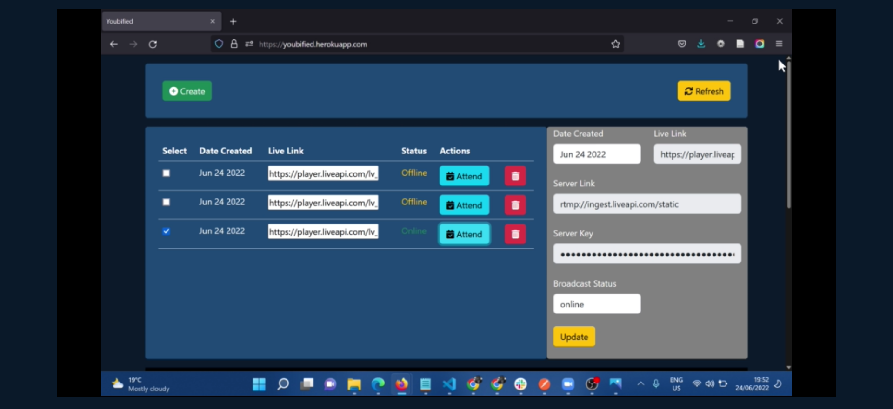

# Youbified

## Youbified is A web app that allows a user to create, update and delete livestream events, 24/06/2022

### By Tiberius Mairura

## Landing Page

## LiveStream Page

## Live Demo on Youtube

[Youtube Video](https://youtu.be/3Jqf2TfmNEE)

## Table of Content

- [Youbified](#youbified)
  - [Youbified is A web app that allows a user to create, update and delete livestream events, 24/06/2022](#youbified-is-a-web-app-that-allows-a-user-to-create-update-and-delete-livestream-events-24062022)
    - [By Tiberius Mairura](#by-tiberius-mairura)
  - [Landing Page](#landing-page)
  - [LiveStream Page](#livestream-page)
  - [Live Demo on Youtube](#live-demo-on-youtube)
  - [Table of Content](#table-of-content)
  - [Description](#description)
  - [Features](#features)
    - [Requirements](#requirements)
    - [Installation Process](#installation-process)
    - [Live Link](#live-link)
    - [Technology  Used](#technology--used)
  - [Known Bugs](#known-bugs)
  - [Licence](#licence)
  - [Author's Details](#authors-details)

## Description

****
This is a livestream management web application that allows a user to manage livestreams. The user can create, fetch, edit, and update livestream events. They can also attend a livestream right from the web application. The application is built using plain HTML, CSS(Bootstrap) and JS(a little bit of NodeJS server configuration and communication).
****

[Go Back to the top](#youbified)

## Features

As a user you should be able to:

1. `Create`  new livestream
2. `Fetch` livestream events
3. `Delete` livestream events
4. `Update` livestream events
5. `Attend` livestream events

[Go Back to the top](#youbified)

### Requirements

- Access to  a computer, mobile phone or any other garget
- Internet access

### Installation Process

****

- Clone to this repo by running the command : `git clone https://github.com/hermitex/youbified.git`
- Unzip the downloaded files in a folder of choice.
- Open the folder with your favorite CLI tool.
- Run `npm install` on your terminal from inside the root folder of the project
- Run `node index.js` on your terminal from inside the root folder of the project to run the server
- The server should run on `http://localhost:3001`
- If the port is busy, kindly feel free to change the port inside the index.js file
- Once the server is up and running, visit the link  `http://localhost:3001` to access the application
- Note that if you changed the port number, you will have a different port number on the link
- At this point, you will see the home page
- Great!!! Try to create some livesream events...
- Open the index.html file from the zipped file with any browser.

 ****
[Go Back to the top](#youbified)

### Live Link

- Click this [link](https://youbified.herokuapp.com/) to view the live application
  
****

### Technology  Used

- HTML -to develop the structure off the page

- CSS - to style the User Interface
- Bootstrap - to facilitate responsiveness
- JavaScript - to manipulate the DOM and display appropriate data to the UI based on the use actions
- NodeJS - to support API calls and server communication
- LiveStream API - to facilitate communication with live streams

[Go Back to the top](#youbified)

****

## Known Bugs

- No bugs found yet. Please report bugs in case you spot one.

****

## Licence

MIT License
Copyright (c) [2022] [Tiberius Mairura]
Permission is hereby granted, free of charge, to any person obtaining a copy
of this software and associated documentation files (the "Software"), to deal
in the Software without restriction, including without limitation the rights
to use, copy, modify, merge, publish, distribute, sublicense, and/or sell
copies of the Software, and to permit persons to whom the Software is
furnished to do so, subject to the following conditions:
The above copyright notice and this permission notice shall be included in all
copies or substantial portions of the Software.
THE SOFTWARE IS PROVIDED "AS IS", WITHOUT WARRANTY OF ANY KIND, EXPRESS OR
IMPLIED, INCLUDING BUT NOT LIMITED TO THE WARRANTIES OF MERCHANTABILITY,
FITNESS FOR A PARTICULAR PURPOSE AND NONINFRINGEMENT. IN NO EVENT SHALL THE
AUTHORS OR COPYRIGHT HOLDERS BE LIABLE FOR ANY CLAIM, DAMAGES OR OTHER
LIABILITY, WHETHER IN AN ACTION OF CONTRACT, TORT OR OTHERWISE, ARISING FROM,
OUT OF OR IN CONNECTION WITH THE SOFTWARE OR THE USE OR OTHER DEALINGS IN THE
SOFTWARE.

[Go Back to the top](#youbified)
****

## Author's Details

Feel free to reach out via:

- StackOverflow Profile - [Tiberius Mairura](https://stackoverflow.com/users/11869442/tiberius)
- Linked - [Tiberius Mairura](https://www.linkedin.com/in/tiberius-mairura/)
- Dev.to - [Tiberius Mairura](https://dev.to/hermitex)

[Go Back to the top](#youbified)
****
